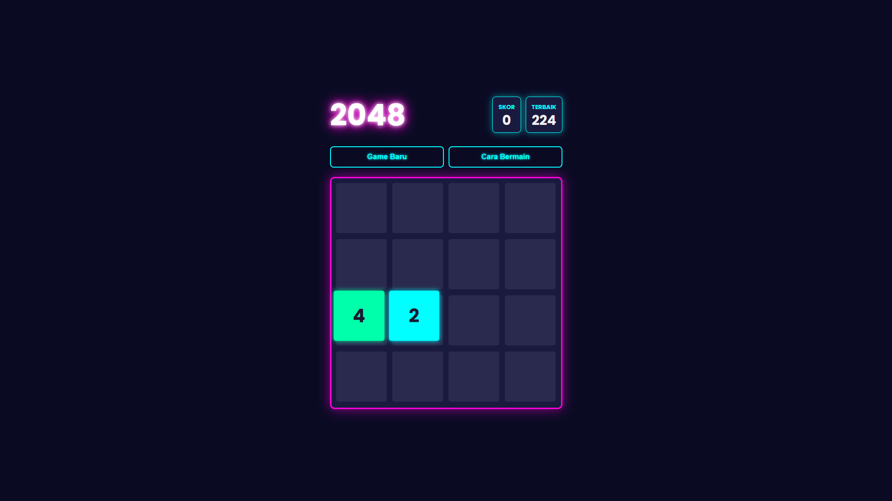

# 🎮 Neon 2048 💡

Sebuah versi modern dari game klasik 2048, dibangun dengan tema neon yang ramping dan gelap. Proyek ini dibuat dengan HTML, CSS, dan JavaScript murni, serta sepenuhnya responsif untuk dimainkan di desktop maupun perangkat seluler.

---

## ✨ Fitur-fitur

* **Desain Neon Modern:** UI dark-mode yang elegan dengan ubin (tiles) yang bersinar dan efek neon.
* **Gameplay 2048 Klasik:** Gabungkan ubin untuk mencapai angka 2048.
* **Sepenuhnya Responsif:** Desain menyesuaikan diri dengan mulus dari layar desktop besar hingga layar ponsel kecil.
* **Kontrol Ganda:**
    * **Desktop:** Mainkan menggunakan tombol panah (`&uarr; &darr; &larr; &rarr;`).
    * **Seluler:** Mainkan dengan menggeser (swipe) jari Anda di layar.
* **Skor Terbaik (High Score):** Skor tertinggi Anda secara otomatis disimpan di browser (menggunakan Local Storage).
* **Efek Suara:** Dilengkapi suara untuk menggeser ubin, menang, dan kalah.
* **Instruksi Game:** Modal (pop-up) "Cara Bermain" yang jelas untuk pemain baru.

---

## 🚀 Cara Menjalankan

Anda tidak memerlukan server atau alat build apa pun untuk menjalankan game ini.

1.  **Unduh File Proyek**
    Pastikan Anda memiliki tiga file utama dalam satu folder yang sama:
    * `index.html`
    * `style.css`
    * `script.js`

2.  **Tambahkan File Suara (PENTING)**
    Game ini membutuhkan tiga file audio agar dapat berfungsi dengan benar. Unduh file `.mp3` singkat untuk setiap aksi dan letakkan di folder yang **sama** dengan file `index.html`.

    Pastikan nama filenya persis seperti ini:
    * `slide.mp3` (suara gesekan ubin)
    * `win.mp3` (suara saat mencapai 2048)
    * `lose.mp3` (suara saat game over)

3.  **Buka di Browser**
    Cukup klik dua kali file `index.html` untuk membukanya di browser web favorit Anda (seperti Chrome, Firefox, atau Safari).

---

## 🛠️ Teknologi yang Digunakan

* **HTML5:** Untuk struktur dasar dan konten game.
* **CSS3:** Untuk semua styling, desain neon, animasi, dan tata letak responsif (menggunakan Flexbox, Grid, dan `clamp()`).
* **JavaScript (ES6+):** Untuk semua logika game, penanganan event (keyboard & sentuhan), manipulasi DOM, dan penyimpanan skor.